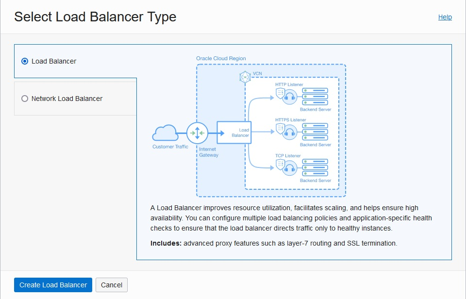
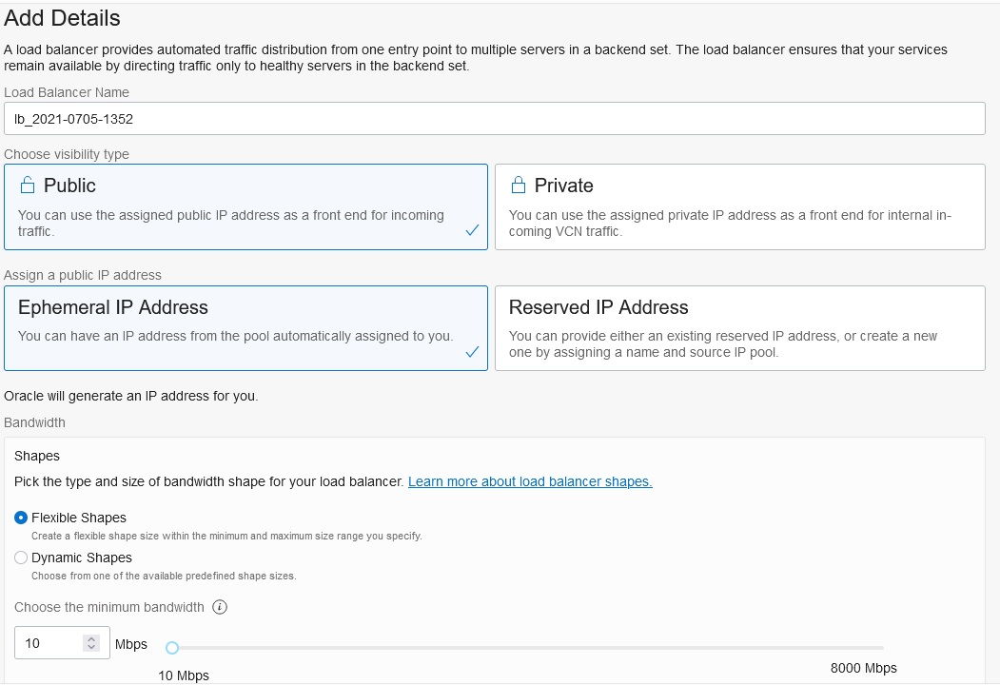
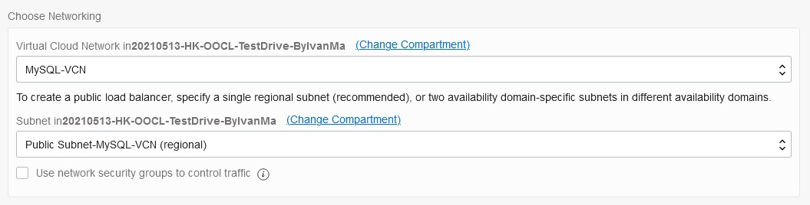
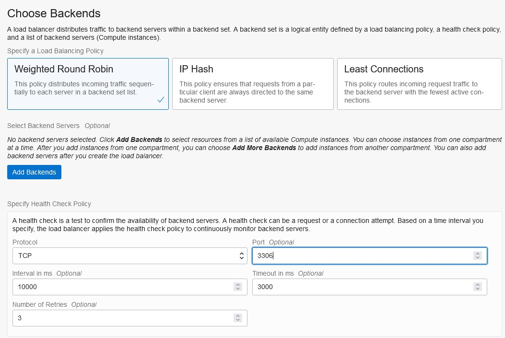
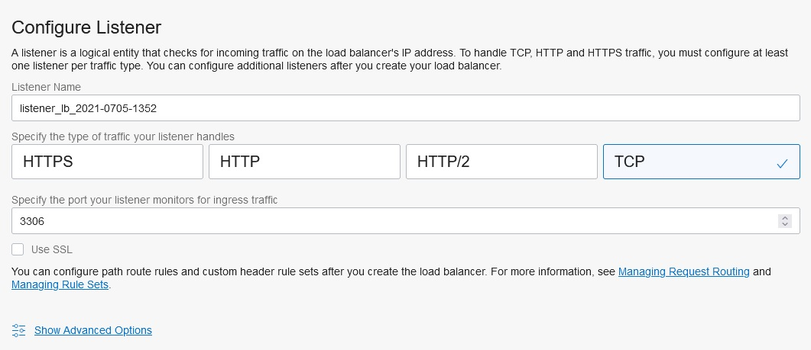
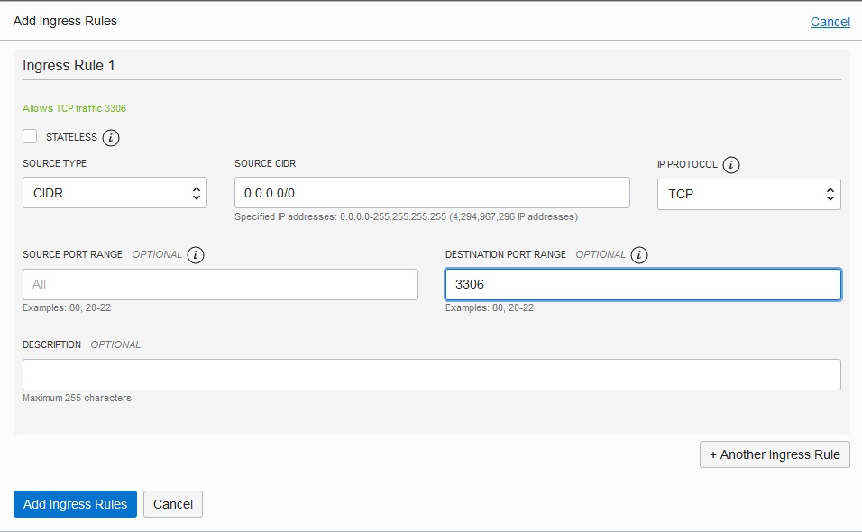

# [OPTIONAL] Connecting external clients to MDS

For testing purposes, you can provision a public Load Balancer to listen on default port 3306 to connect your on-premises or cloud applications to MDS

1. Create a Load Balancer

2. Use the default settings

3. Choose the right VCN

4. Specify the TCP protocol and port 3306

5. Select TCP protocol and port 3306 for the **listener**

6. Create the load balancer

