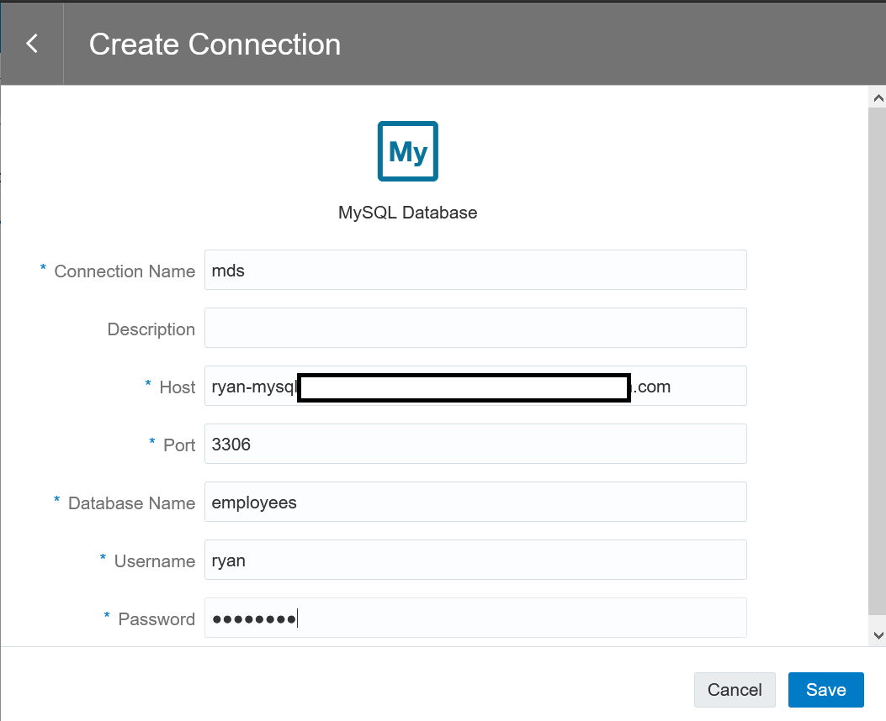
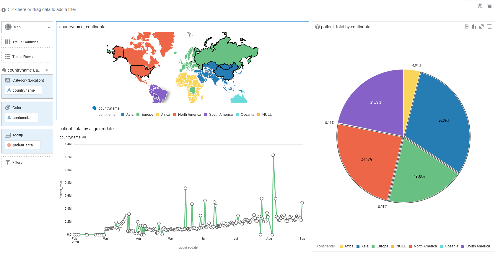

# Running OAC on MDS
Oracle Analytics Cloud (OAC) is an enterprise analytics solution for building analytics dashboard, pixel-perfect high quality reports. OAC provides Machine Learning algorithm to exploit insights from your data

In order to build analytics dashboard using OAC on MDS HeatWave, we need to do the following
1. Provision a Load Balancer to connect to MDS
2. Create a user account on MDS
3. Provision an OAC instance
4. Starting building your dashboard


## Provision OAC instance

1. First of all, create a policy to provision OAC instance
2. Click on the hamburger on the top left corner of OCI console, navigate to Identify -> Policies
3. Specify a policy name such as **oac-policy**, enter the folloing policy in the policy editor by clicking on **customized**
```
allow group Administrator-Group to manage analytics-instances in tenancy
allow group Administrator-Group to manage analytics-instances in compartment MyOracleAnalytics
```


4. Once you created the policy, click of the hamburger on the top left corner of OCI console, navigate to **Analytics-> Analytics Clouds**


5. Specify the name of the OAC instance such as **myoac**, just leave all the default options, and click on **Create**
**Please note that the maximum number of records for 1 OCPU shape of OAC is 125,000 records**
More informatin here: https://docs.oracle.com/en/cloud/paas/analytics-cloud/acsom/create-services-oracle-analytics-cloud.html#GUID-164D8568-9AE3-4A74-9F1A-0D87B78713C9


6. Configure Private Access Channel (PAC) to access MDS in the private subnet
Configure PAC to use the **Virtual Cloud Network** and the **Private Subnet** which MDS is provisioned, this PAC will be used to access the MDS in the private subnet. **Be sure to add the DNS zone of the private subnet of MDS**


# Build Dashboard on OAC

1. Navigate to **hamburger->Analytics->Analytics Clouds**


2. Select the OAC instance you provisioned to access the OAC console by clicking on **Analytics Home Page** 


3. First of all, we need to create a **Connection** to HeatWave to build a dashboard


4. Search for **mysql** and select **mysql** as the database


5. Specify the connections details
Specify the hostname of MDS in FQDN such as mysql-xxx.oraclevpn.com and make sure that the mysql user is using **mysql_native_password**



6. Next we are ready to build the dashboard on MDS HeatWave by selecting **Create->Project**


7. Select **Create Data Set**


8. Select the **Connection** created earlier


9. Select the database **covid19**, and select **Enter SQL**


10. We will create a custom data set by using SQL join statement with the following SQL
```
select p.id, p.age, p.gender, p.admin2, v.province, v.countryname, c.continental, p.acquireddate, p.recovereddate, p.passawaydate from covid19.patient p, covid19.province v, covid19.country c where p.provinceid=v.id and v.countryid=c.id;
```
Give it a name and make sure you select **Live** in the **Data Access** field


11. You are now ready to build the dashboard
You can pick and choose columns from the left pane to build your dashboard



## [Optional] Additional database import to MDS

1. Gather MDS information
* MDS host name
* user
* password

2. Install mysql client
```
wget https://dev.mysql.com/get/mysql80-community-release-el7-3.noarch.rpm
rpm -Uvh mysql80-community-release-el7-3.noarch.rpm
sudo yum install mysql mysql-router 
```
3. Configure mysqlrouter
```
sudo cat << EOF >> /etc/mysqlrouter/mysqlrouter.conf
[routing:forward]
bind_address = 0.0.0.0
bind_port = 6446
destinations = 10.0.1.37:3306
routing_strategy = round-robin
EOF
mysql -uadmin -h127.0.0.1 -P6446 -p
```

4. Create sample **employee** database in MDS
```
mkdir data
cd data
wget https://github.com/datacharmer/test_db/archive/master.zip
unzip master.zip
cd test_db-master
mysql -uadmin -h<mds-hostname> -P3306 -p < employees.sql
```

## [Optional] Provision a bastion host to connect to MDS/HeatWave
1. Provision a compute instance on OCI with a Public IP address
2. ssh to the compute instance using **opc** user with the private key you created in step 1
3. Install mysql clients
```
wget https://dev.mysql.com/get/mysql80-community-release-el7-3.noarch.rpm
sudo rpm -Uvh mysql80-community-release-el7-3.noarch.rpm
sudo yum repolist all | grep mysql
sudo yum-config-manager --enable mysql80-community
sudo yum repolist enabled | grep mysql
sudo yum install mysql-client mysql-shell mysql-router
```

4. Locate your MDS hostname to create an account
```
mysql -uadmin -hyour_mds_host_name -P3306 -p
create user oac_user@'%' identified with mysql_native_password by 'oac_secret';
grant all privileges on *.* to oac@'%';
```

5. configure the mysqlrouter
```
sudo cat << EOF >> /etc/mysqlrouter/mysqlrouter.conf 
[routing:redirect_classic]
bind_address = 0.0.0.0:3306
destinations = 10.0.0.98:3306
routing_strategy=first-available

[routing:redirect_xprotocol]
bind_address = 0.0.0.0:33060
destinations = 10.0.0.98:33060
protocol = x
routing_strategy=first-available
EOF
```

6. Add ingress rule in your security list of your VCN
Add an ingress rule to allow traffic in your private subnet

7. Start mysqlrouter
```
sudo systemctl stop firewalld
sudo systemctl disable firewalld
sudo mysqlrouter &
mysql -uadmin -h127.0.0.1 -P3306 -p
```

## [Optional] Provision Load Balancer
The purpose of the Load Balancer is to forward traffics from internet to MDS in OCI private subnet

1. Provision Load Balancer with **Public IP address** with a **TCP Listener** listening on port **3306**
2. Define **Backend Set** with MDS instance details such as **IP Address** and **Port Number**
3. Create a **Ingress rule** of allowing internet traffic (0.0.0.0/0) to **Port 3306**
4. Test the connection from **mysql** client

```
mysql -uadmin -h<public_ip_load_balancer> -P3306 -p
```


