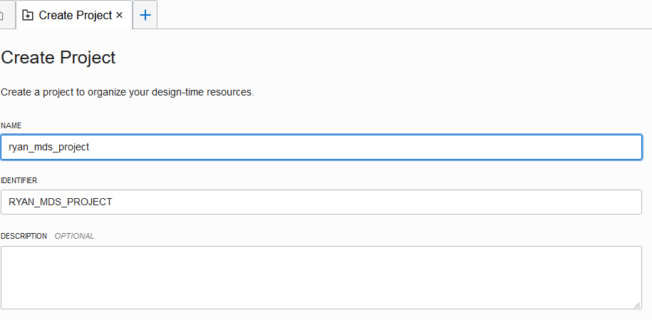

# Loading data using Data Integration to MDS
We will use Data Integration to load data to MDS. For simplicity, we will load from one database to another database within the same MDS instance

## Provision Data Integration

1. Create policies
Navigate to **Identify->Policies** to create the following policies

```
allow service dataintegration to use virtual-network-family in compartment RyanKuan-Sandbox	
allow any-user to use buckets in compartment RyanKuan-Sandbox where ALL {request.principal.type='disworkspace', request.principal.id='you_ocid'}	
allow any-user to manage objects in compartment RyanKuan-Sandbox where ALL {request.principal.type='disworkspace',request.principal.id='your_ocid'}	
allow any-user {PAR_MANAGE} in compartment RyanKuan-Sandbox where ALL {request.principal.type='disworkspace', request.principal.id='you_ocid'}	
```

2. Provision Data Ingration instance
Navigate to **Data Integration** to provision a Data Integration instance


## Create Data Ingration Project

1. First of all, create a **Data Asset** to connect to MDS
Specify the **name, Type, Host, Port, Database, User, Password**, and test the connection before saving the Data Asset


2. Create Project


3. Specify the Project name



4. Create a folder


5. Create Data Loader task


6. Select the source
We will use the **employees** database, **employees** table as **source**


7. Select the target
We will use the **db1** database as the **target**, check the **create new data entity**


8. Save the task


9. Publish the task
We need to publish the data loading task to a new **application**


10. Run the task
Finally, run the data loading task


11. Check your task
Once the task is completed, you should be able to see the data is loaded from **employees** database to **db1** database


